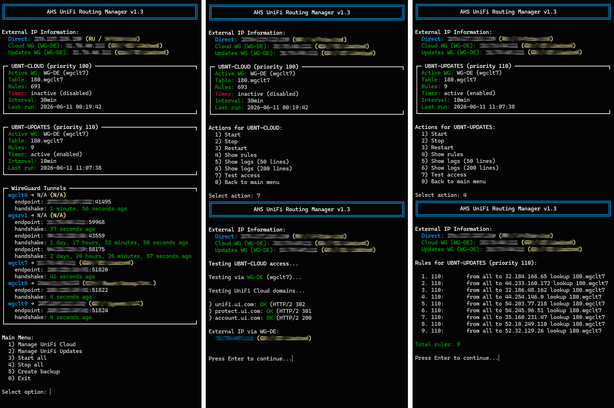

# UniFi Routing Manager

**Система управления маршрутизацией для UniFi Dream Machine (UDM), позволяющая направлять трафик UniFi Cloud и Updates через WireGuard туннели.**

> Применимо именно к UDM, т.к. policy based routes распространяются только на **устройства** подключенные к UDM.
Для владельцев Unifi Cloud Key данный метод излишен.

## 🎯 Возможности

- 🔄 Автоматическое переключение между WireGuard туннелями (Failover)
- 🌍 Маршрутизация облачных сервисов (UI Cloud) через WireGuard
- 📦 Маршрутизация обновлений прошивок (UI Update) через WireGuard
- 📊 Интерактивный менеджер с мониторингом
- 🔍 Определение геолокации и провайдера внешних IP
- ⏱️ Автообновление AWS сетей для UI Cloud по расписанию (Systemd интеграция)



## 📁 Структура проекта
```bash
/persistent/
├── ubnt-cloud/
│   ├── ubnt-cloud-routes.sh       # Скрипт маршрутизации UI Cloud
│   ├── wg-map.conf                # Карта WireGuard туннелей
│   ├── domains.txt                # Домены для маршрутизации
│   ├── addresses.txt              # IP адреса (авто-заполнение)
│   ├── networks.txt               # Сети для маршрутизации
│   ├── active-table               # Активная таблица маршрутизации
│   ├── active-iface               # Активный интерфейс
│   ├── active-name                # Имя активного туннеля
│   └── ubnt-cloud-routes.log      # Лог работы
│
├── ubnt-updates/
│   ├── ubnt-updates-routes.sh     # Скрипт маршрутизации UI Updates
│   ├── wg-map.conf                # Карта WireGuard туннелей
│   ├── update-domains.txt         # Домены для обновлений
│   ├── active-table               # Активная таблица маршрутизации
│   ├── active-iface               # Активный интерфейс
│   ├── active-name                # Имя активного туннеля
│   └── ubnt-updates-routes.log    # Лог работы
│
└── unifi-routing-manager.sh       # Интерактивный менеджер

```

## 🚀 Установка

### 1. Клонировать репозиторий

```bash
cd /persistent
git clone https://git.akinin.su/akininav/unifi-routing-manager.git
cd unifi-routing-manager
```

### 2. Скопировать файлы в рабочие директории
```bash
# Скопировать проекты
cp -r ubnt-cloud /persistent/
cp -r ubnt-updates /persistent/

# Скопировать менеджер
cp unifi-routing-manager.sh /persistent/

# Установить права выполнения
chmod +x /persistent/unifi-routing-manager.sh
chmod +x /persistent/ubnt-cloud/*.sh
chmod +x /persistent/ubnt-updates/*.sh
```

### 3. Создать пустые файлы для динамических данных
```bash
touch /persistent/ubnt-cloud/addresses.txt
touch /persistent/ubnt-cloud/active-iface
touch /persistent/ubnt-cloud/active-name
touch /persistent/ubnt-cloud/active-table

touch /persistent/ubnt-updates/active-iface
touch /persistent/ubnt-updates/active-name
touch /persistent/ubnt-updates/active-table
```

## ⚙️ Конфигурация

### WireGuard интерфейсы

Перед настройкой убедитесь, что WireGuard туннели созданы и работают:

```bash
# Показать WireGuard интерфейсы с их таблицами и IP
echo "# Формат: table interface name"
ip rule show | grep -oP 'from \d+\.\d+\.\d+\.\d+ lookup \K\d+\.wgclt\d+' | while read entry; do
  table=$(echo $entry | cut -d. -f1)
  iface=$(echo $entry | cut -d. -f2)
  ip=$(ip -br addr show $iface 2>/dev/null | awk '{print $3}')
  printf "%-3s %-10s %-15s WG-NAME\n" "$table" "$iface" "$ip"
done
```
Пример вывода:
```bash
# Формат: table interface name
001 wgclt4     172.16.6.2/32   WG-NAME
180 wgclt7     10.5.0.3/32     WG-NAME
178 wgclt8     10.6.0.3/32     WG-NAME
002 wgclt9     10.7.0.3/32     WG-NAME
```
> 💡 Используйте эти данные для создания `wg-map.conf`, просто замените `WG-NAME` на понятные названия (например, WG-DE, WG-NL).


#### wg-map.conf

Пример:

```bash
180 wgclt7 WG-DE
181 wgclt8 WG-NL
...
```
- (180, 181, и т.д.) - номер таблицы маршрутизации
- (wgclt7, wgclt8) - имя WireGuard интерфейса
- (WG-DE, WG-NL) - понятное имя для отображения (WG-DE, WG-NL)

#### domains.txt (UniFi Cloud)
Список доменов для маршрутизации через WireGuard:

```bash
a1ewuiz2p7wdvw-ats.iot.us-west-2.amazonaws.com
c3sdnuexugkg7e.credentials.iot.us-west-2.amazonaws.com
cloudaccess.svc.ubnt.com
cloudaccess.svc.ui.com
device-api-pxy.svc.ui.com
nca-iot-us-west-2.svc.ui.com
unifi.ui.com
protect.ui.com
account.ui.com
sso.ui.com
api.ui.com
trace.svc.ui.com
remote-access.svc.ui.com
device.svc.ui.com
console.ui.com
static.ui.com
assets.ui.com
```

#### update-domains.txt (UniFi Updates)
Список доменов для обновлений прошивок:

```bash
fw-download.ubnt.com
fw-update.ubnt.com
fw-update.ui.com
apt.artifacts.ui.com
apt-release-candidate.artifacts.ui.com
apt-beta.artifacts.ui.com
```

#### networks.txt (UniFi Cloud)
Статические сети в формате CIDR:

```bash
3.33.236.0/22
18.64.0.0/14
52.94.76.0/22
...
```

### Создайте alias для быстрого запуска
```bash
# Добавить alias в .bashrc
cat >> ~/.bashrc <<'EOF'

# UniFi Routing Manager
alias urm='/persistent/unifi-routing-manager.sh'
alias unifi-routing='/persistent/unifi-routing-manager.sh'
EOF

source ~/.bashrc
```

### Можно использовать дополнительные команды для ~/.bashrc
```bash
cat >> ~/.bashrc <<'EOF'

# UniFi Routing quick commands
alias urm-status='systemctl status ubnt-cloud-routes.timer ubnt-updates-routes.timer --no-pager'
alias urm-logs-cloud='tail -f /persistent/ubnt-cloud/ubnt-cloud-routes.log'
alias urm-logs-updates='tail -f /persistent/ubnt-updates/ubnt-updates-routes.log'
alias urm-rules='echo "Cloud (100):"; ip rule show | grep "^100:" | grep wgclt | wc -l; echo "Updates (110):"; ip rule show | grep "^110:" | grep wgclt | wc -l'
EOF

source ~/.bashrc
```

- `urm` — запустить менеджер
- `urm-status` — статус systemd
- `urm-logs-cloud` — логи Cloud в реальном времени
- `urm-logs-updates` — логи Updates в реальном времени
- `urm-rules` — количество правил


## 📋 Использование
Интерактивный режим:
```bash
/persistent/unifi-routing-manager.sh
```
Меню позволяет:

- Управлять проектами (Cloud/Updates)
- Запускать/останавливать маршрутизацию
- Просматривать статус
- Управлять systemd сервисами и таймерами
- Обновлять конфигурации

Ручной запуск:

```bash
# UniFi Cloud
/persistent/ubnt-cloud/ubnt-cloud-routes.sh

# UniFi Updates
/persistent/ubnt-updates/ubnt-updates-routes.sh

# Обновить AWS сети
/persistent/ubnt-cloud/update-aws-networks.sh
```

## 🔄 Systemd интеграция
#### Создание сервисов
**Через интерактивное меню:**

1. Выберите проект (Cloud или Updates)
1. Выберите "Manage systemd service"
1. Выберите "Create/Update service"

**Ручное создание файлов:**

UniFi Cloud Service (`/etc/systemd/system/ubnt-cloud-routes.service`)

```bash
[Unit]
Description=UniFi Cloud Routes via WireGuard
After=network-online.target
Wants=network-online.target

[Service]
Type=oneshot
ExecStart=/persistent/ubnt-cloud/ubnt-cloud-routes.sh
StandardOutput=journal
StandardError=journal

[Install]
WantedBy=multi-user.target
```
UniFi Cloud Timer (`/etc/systemd/system/ubnt-cloud-routes.timer`):

```bash
[Unit]
Description=Update UniFi Cloud routes every 30 minutes

[Timer]
OnBootSec=2min
OnUnitInactiveSec=30min
AccuracySec=1min

[Install]
WantedBy=timers.target
```
Управление сервисами:
```bash
# Включить и запустить таймер
systemctl enable ubnt-cloud-routes.timer
systemctl start ubnt-cloud-routes.timer

# Проверить статус
systemctl status ubnt-cloud-routes.timer
systemctl status ubnt-cloud-routes.service

# Посмотреть логи
journalctl -u ubnt-cloud-routes.service -f

# Вручную запустить сервис
systemctl start ubnt-cloud-routes.service
```
## 🔍 Диагностика
Проверка маршрутов:
```bash
# Проверить доступность через туннель
ping -I wgclt7 8.8.8.8

# Проверить внешний IP через туннель
curl --interface wgclt7 ifconfig.me

# Посмотреть активные маршруты в таблице 180
ip route show table 180

# Проверить правила маршрутизации
ip rule show

# Проверить DNS резолвинг
nslookup shard.id.ui.com

# Проверить адреса в файле
cat /persistent/ubnt-cloud/addresses.txt
```

Логи:
```bash
# Логи скриптов (если запущены вручную)
tail -f /persistent/ubnt-cloud/ubnt-cloud-routes.log
tail -f /persistent/ubnt-updates/ubnt-updates-routes.log

# Логи systemd сервисов
journalctl -u ubnt-cloud-routes.service -n 50
journalctl -u ubnt-updates-routes.service -n 50
```
## 🛠️ Обновление
```bash
cd /persistent/unifi-routing-manager
git pull

# Скопировать обновлённые файлы
cp -r ubnt-cloud/* /persistent/ubnt-cloud/
cp -r ubnt-updates/* /persistent/ubnt-updates/
cp unifi-routing-manager.sh /persistent/

# Перезапустить сервисы (если используются)
systemctl restart ubnt-cloud-routes.service
systemctl restart ubnt-updates-routes.service
```
## 📝 Примечания
- Скрипты используют `dig` для резолва доменов
- Маршруты добавляются в отдельные таблицы маршрутизации (180, 181, и т.д.)
- При наличии нескольких WireGuard туннелей используется round-robin балансировка
- Логи ротируются автоматически (последние 1000 строк)
- Файл `addresses.txt` (только для ubnt-cloud) генерируется автоматически и не должен редактироваться вручную

## 🐛 Известные проблемы
После перезагрузки UDM маршруты не сохраняются автоматически

Решение: используйте systemd таймеры с `OnBootSec=2min`
